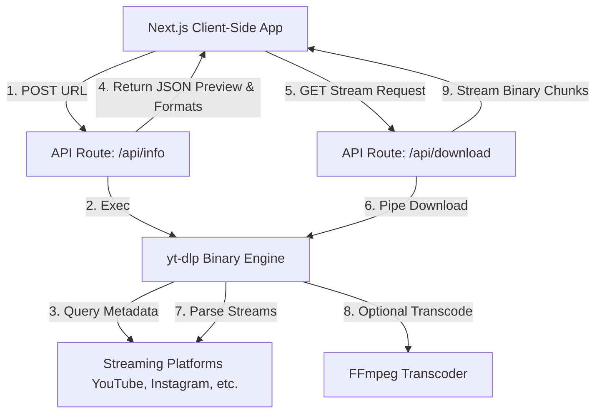
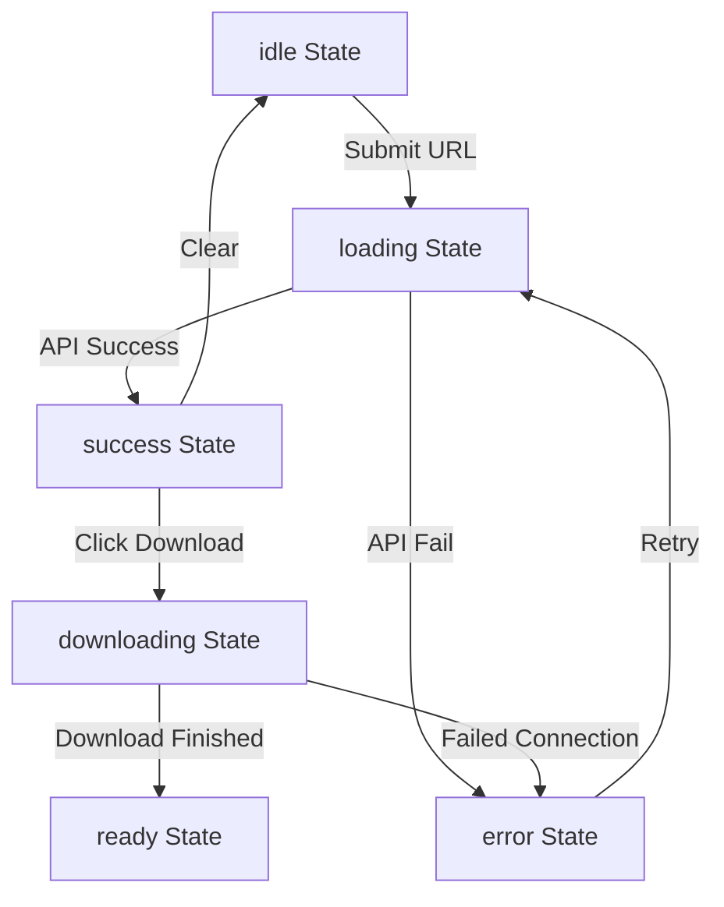
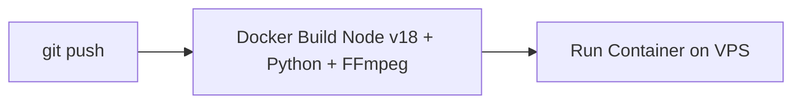

# Technical Requirements Document (TRD) — MediaDL

## 1. System Architecture
MediaDL uses a modular, two-tier architecture consisting of a static Next.js frontend rendering React components and a serverless-friendly API backend wrapping CLI media extraction executables.

### 1.1 Architectural Component Overview


---

## 2. Folder Structure
The complete layout of the Next.js project is structured to enforce separation of concerns, isolating UI presentation components from the business logic utilities:

```
media-downloader/
├── .next/                  # Built output
├── docs/                   # Product and architecture documentation
│   ├── PRD.md
│   ├── TRD.md
│   └── WORKFLOW.md
├── public/                 # Static public assets (images, icons)
├── src/
│   ├── app/                # Next.js App Router core routing
│   │   ├── api/
│   │   │   ├── download/
│   │   │   │   └── route.ts  # Download streamer endpoint
│   │   │   └── info/
│   │   │       └── route.ts  # Metadata extractor endpoint
│   │   ├── globals.css     # Global styling system & color tokens
│   │   ├── layout.tsx      # Core application layout
│   │   └── page.tsx        # Main application controller
│   ├── components/         # Reusable UI elements
│   │   ├── layout/
│   │   │   ├── footer.tsx  # Standard footer
│   │   │   └── navbar.tsx  # Navbar with theme switches
│   │   ├── sections/
│   │   │   ├── download-options.tsx  # Format selection grid
│   │   │   ├── empty-state.tsx       # Idle page setup
│   │   │   ├── error-card.tsx        # User error handling card
│   │   │   ├── hero.tsx              # Page headers & layout orbs
│   │   │   ├── metadata-preview.tsx  # Media preview cards
│   │   │   ├── progress-section.tsx  # Download progress bar
│   │   │   └── url-input.tsx         # User link inputs
│   │   └── ui/             # Core design components
│   │       ├── button.tsx
│   │       ├── card.tsx
│   │       ├── input.tsx
│   │       ├── progress.tsx
│   │       ├── skeleton.tsx
│   │       └── theme-toggle.tsx
│   ├── lib/
│   │   └── utils.ts        # Tailwind merge helper (clsx/tailwind-merge)
│   ├── types/
│   │   └── index.ts        # App-wide TypeScript typings
│   └── utils/              # Utility helpers
│       ├── bin-resolver.ts # OS-specific binary resolver
│       ├── constants.ts    # String and URL regex configurations
│       ├── format-helpers.ts # Duration and byte size format converters
│       └── url-validator.ts  # Input sanitization logic
├── tsconfig.json           # TS rules
└── next.config.ts          # Build config
```

---

## 3. Tech Stack
* **Framework**: Next.js 15.2.9 (Turbopack, App Router, Serverless compatible API routing).
* **Language**: TypeScript 5.0 (Strict typing enabled).
* **UI Layer**: React 19 (Hooks, Suspense, and client state orchestration).
* **Styles**: Tailwind CSS v4.0 (Custom curated HSL variables).
* **Animations**: Framer Motion 11.0 (CSS GPU-accelerated transitions).
* **Core CLI Engine**: `yt-dlp` (Resolves metadata extraction and streaming endpoints).
* **Transcoding Engine**: `ffmpeg` (Enables audio extraction, conversions, and video merging).

---

## 4. Frontend Architecture
The client is completely component-driven. The main controller page (`page.tsx`) acts as an orchestrator holding the state machine of the app:



* **Tailwind CSS v4 Design Tokens**: The global design system utilizes deep grays (`#050816`), neon accents (`#6366F1` indigo), and semi-transparent cards (`rgba(255,255,255,0.05)`) with backdrop filters to produce a premium glassmorphic UI.
* **Component Splitting**: Sub-components are fully decoupled; UI state properties are passed down as read-only properties, keeping the UI fast and eliminating unwanted rendering loops.

---

## 5. Backend Architecture
The backend is composed of two serverless API endpoints:
1. **Metadata Extractor (`/api/info`)**:
   * Accepts JSON payloads containing the URL.
   * Calls `yt-dlp --dump-single-json` asynchronously.
   * Filters the returned object to output formats, sizes, and platforms.
2. **Media Streamer (`/api/download`)**:
   * Accepts search queries (`url`, `itag`, `type`, `filename`).
   * Spawns `yt-dlp` to write to a temporary file locally.
   * Creates a Node read stream and pipes it directly into a standard Web `ReadableStream` returned in a `NextResponse`.

---

## 6. Database Design
* **Database Presence**: **None**.
* **Stateless Rationale**: To ensure absolute user privacy and meet rigorous security standards, the system has no database (SQL or NoSQL). No logs are recorded containing user URLs, and no persistence exists beyond the scope of a live API execution.

---

## 7. API Design

### 7.1 POST /api/info
Fetches the media preview information.

* **Request Body**:
  ```json
  {
    "url": "https://www.youtube.com/watch?v=dQw4w9WgXcQ"
  }
  ```
* **Success Response (200 OK)**:
  ```json
  {
    "type": "single",
    "title": "Rick Astley - Never Gonna Give You Up (Official Music Video)",
    "thumbnail": "https://i.ytimg.com/vi/dQw4w9WgXcQ/maxresdefault.jpg",
    "duration": 212,
    "author": "Rick Astley",
    "viewCount": 1450000000,
    "platform": "youtube",
    "formats": [
      {
        "itag": "mp4-720",
        "qualityLabel": "720p HD",
        "resolution": "720p",
        "container": "mp4",
        "type": "video",
        "filesize": 15640302,
        "isAvailable": true,
        "isRecommended": true,
        "mimeType": "video/mp4",
        "extension": "mp4",
        "filename": "youtube_rick_astley_never_gonna_give_you_up_720p.mp4"
      }
    ]
  }
  ```

### 7.2 GET /api/download
Pipes the media stream to the client.

* **Request Parameters**:
  * `url`: String (Escaped URL)
  * `itag`: String (Identifier format)
  * `type`: "video" | "audio"
  * `filename`: String (Desired filename)
* **Headers Returned**:
  * `Content-Disposition`: `attachment; filename="youtube_rick_astley_never_gonna_give_you_up_720p.mp4"`
  * `Content-Type`: `video/mp4`
  * `Content-Length`: `15640302`

---

## 8. Authentication & Authorization Design
* **Authentication**: **None**.
* **Rationale**: The application is open-access to remove barriers to usage. No accounts, login forms, or sessions are supported.
* **Rate Limiting**: Configured at the reverse-proxy layer (e.g. Nginx or Cloudflare) to prevent DDoS attacks and server abuse.

---

## 9. State Management
All application state is kept locally within the memory of the client browser using React's standard `useState` hooks. No global state providers (Redux, Zustand, Context API) are required, keeping the application lightweight.

---

## 10. Environment Variables
To customize behavior on self-hosted environments:

```bash
# Path overrides for environments where binaries are installed in custom directories
YTDLP_PATH="C:\\winget\\yt-dlp.exe"
FFMPEG_PATH="C:\\winget\\ffmpeg.exe"

# Execution Timeouts (milliseconds)
METADATA_TIMEOUT=30000
DOWNLOAD_TIMEOUT=300000
```

---

## 11. Error Handling & Logging Strategy

### 11.1 Error Propagation Flow
```mermaid
sequenceDiagram
    participant User
    participant Client
    participant API
    participant Binary
    
    User->>Client: Pastes URL
    Client->>API: POST /api/info
    API->>Binary: Exec CLI
    alt Binary not found (ENOENT)
        Binary-->>API: Error
        API-->>Client: 503 Service Unavailable
        Client-->>User: Show "yt-dlp is not installed"
    alt Platform changes / Scrape fails
        Binary-->>API: Exit Code 1
        API-->>Client: 500 Extraction Failed
        Client-->>User: Show "Failed to parse this URL"
    end
```

### 11.2 Logging
Standard system console logs are restricted to performance tracking. No client-submitted URLs are logged to the file system.

---

## 12. Security Architecture
* **XSS Prevention**: React automatically escapes text content. Input fields explicitly strip raw HTML tags.
* **CLI Command Injection**: We use `execFile` rather than `exec` to invoke `yt-dlp`. Arguments are passed as an array of strings, rendering command injections impossible since the shell does not evaluate the input values.
* **Temporary Files Cleanups**: Backend temp files are tracked and deleted synchronously upon stream completion or failure using `fs.unlinkSync`.

---

## 13. Performance Optimization
* **Turbopack**: Used for extremely fast cold compilations in development.
* **Readable Streams**: The backend pipes chunks directly from disk to network sockets immediately as they become available.
* **Delayed Revocation (Chrome Fix)**:
  * **Issue**: Synchronous revocation of blob URLs breaks Chrome's down-stream tracking.
  * **Implementation**: We wait for a repaint frame, click the download anchor, and wait `10000ms` before calling `URL.revokeObjectURL(blobUrl)`.

---

## 14. Deployment Strategy

The application is containerized using Docker to ensure all system dependencies (`yt-dlp`, `ffmpeg`, and `python3`) are pre-configured.

---

## 15. Testing Strategy
* **Unit Tests**: `vitest` tests validate `url-validator.ts` and `format-helpers.ts` modules.
* **Integration Tests**: Playwright scripts automate URL parsing, click selections, and verify file saves with correct names.
