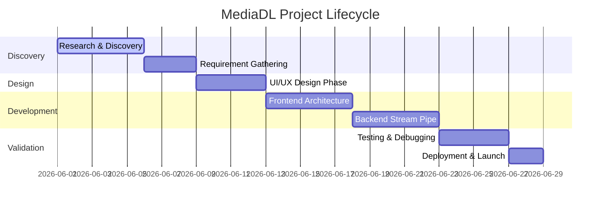
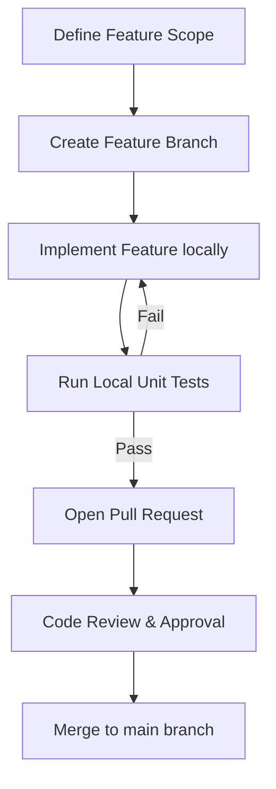
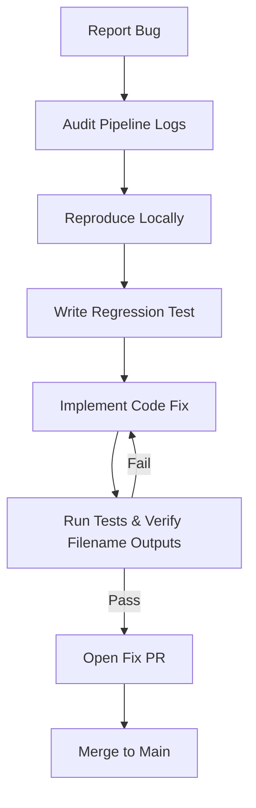
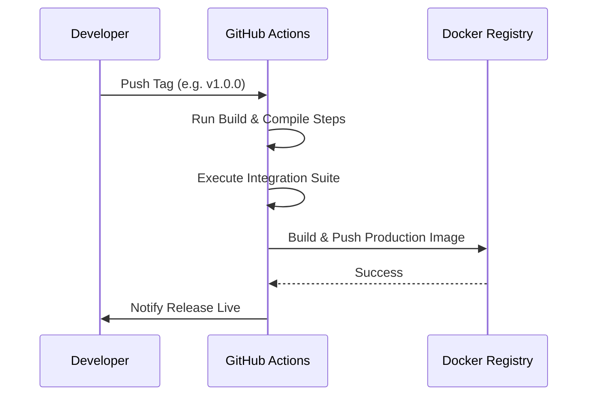
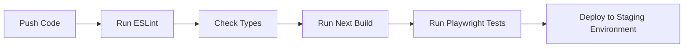
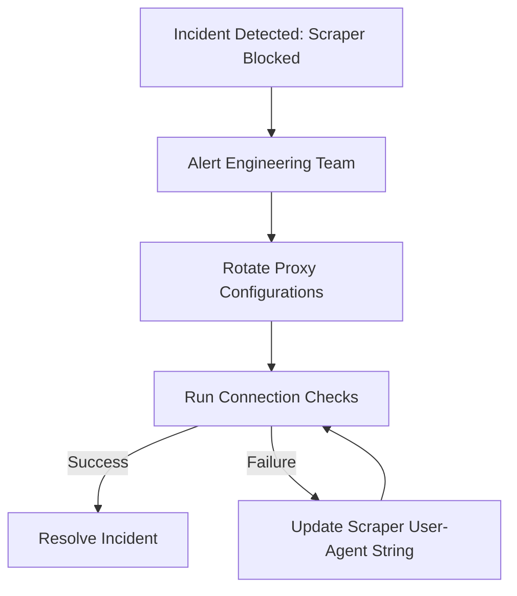

# Project Workflow and Development Process — MediaDL

## 1. Project Lifecycle
The development lifecycle of MediaDL follows a hybrid Agile/Waterfall framework designed to support fast iteration while maintaining robust testing standards for media streaming APIs.



---

## 2. Phase-by-Phase Process

### 2.1 Discovery & Requirement Gathering
* Define platform support scopes (YouTube, Instagram, Facebook, TikTok, Twitter/X).
* Formulate security requirements to prevent shell injection via inputs.
* Establish statelessness guidelines: **Zero database additions allowed**.

### 2.2 Research Phase
* Evaluate CLI tools: Choose `yt-dlp` over outdated libraries.
* Verify FFmpeg codec compatibility (AAC audio, H.264 video, and WebM merging capabilities).
* Investigate browser download behaviors and constraints with blob Object URLs.

### 2.3 UI/UX Design Phase
* Establish HSL color tokens for the premium dark theme.
* Design transitions for metadata skeleton screens and download progress components.
* Ensure clear interactive states for format cards (HD badges, recommended markers).

### 2.4 Development Phase
* Frontend built in Next.js 15 utilizing React 19 Client Components.
* Backend route API setup with custom child-process executors (`execFile`).

### 2.5 Testing Phase
* Validate filename sanitization algorithms locally.
* Test download streams across different browsers (Chrome, Firefox, Safari) and screen dimensions.

### 2.6 Deployment & Maintenance
* Build and publish Docker images.
* Monitor resource utilization (CPU and Memory) during large video transcode operations.

---

## 3. Operations Workflows

### 3.1 Feature Development Workflow
Ensures new capabilities are added cleanly without regressing existing downloader APIs.



### 3.2 Bug Fix Workflow
Addresses bugs (such as corrupted names, scraping errors, or timeouts) systematically.



### 3.3 Release Workflow
Ensures safe versioning and artifact generation for the application.



---

## 4. Git and Branching Strategy

### 4.1 Branching Layout
We follow a structured trunk-based development flow:
* **`main`**: Production-ready branch. Highly protected.
* **`feature/*`**: Short-lived branches for new components or utilities.
* **`fix/*`**: Target branches for resolving active issues.

```
main        ========================================= (Production)
               \             /          \      /
feature/url     ===========             \    /  (Feature branch)
                                         ====    (Fix branch: fix/uuid-bug)
```

### 4.2 Pull Request Rules
1. Must pass lint checking (`npm run lint`) and build testing (`npm run build`).
2. Require at least one peer approval from the senior engineering team.
3. No direct commits to the `main` branch are permitted.

---

## 5. Code Review Process
The code review focuses on the following criteria:

| Review Dimension | Focus Checklist | Standard |
|:---|:---|:---|
| **Security** | Ensure inputs are sanitized and `execFile` is used instead of `exec`. | Critical |
| **Performance** | Stream data chunks directly; avoid accumulating files entirely in server memory. | High |
| **A11y** | Verify keyboard tab indices and contrast ratios on new UI components. | Medium |
| **Type Safety** | No occurrences of `any` types; all interfaces must be fully declared. | High |

---

## 6. CI/CD Workflow
Automatic validation of pushes using GitHub Actions pipelines.



---

## 7. Issue & Incident Management

### 7.1 Issue Triaging
* Issues must contain platform name, input URL (if non-sensitive), browser details, and console outputs.
* Categorized by severity levels (Critical, High, Medium, Low).

### 7.2 Incident Management (e.g. YouTube Blocks Server IP)


---

## 8. Production Deployment Workflow
Steps to roll out updates to the live web application:
1. Verify Next.js build compilation locally or in CI.
2. Build the Docker container.
3. Run container locally to verify `yt-dlp` updates.
4. Execute rolling updates on hosting server to prevent downtime.
5. Perform post-deployment smoke tests verifying video metadata extraction.
